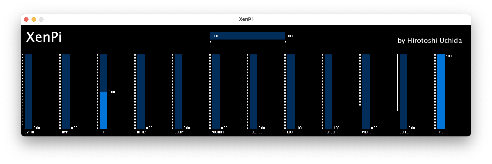
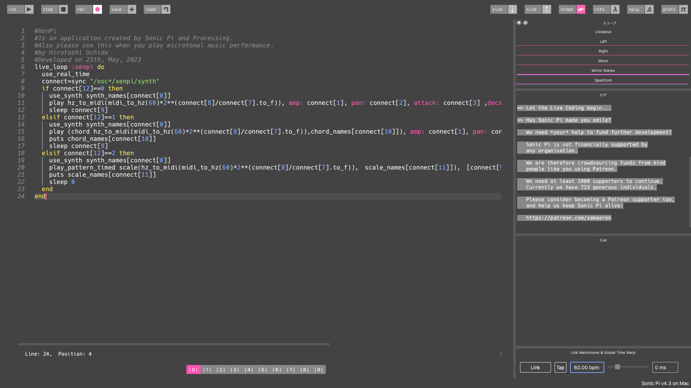

# XenPi
This is an application I developed by Sonic Pi and Processing for playing microtonal performance.

## Download and Install
1. Download this as .zip and unzip any folder.
2. Re-unzip the .zip file with the contents according to your operating system.
3. Then, run the executable file (.exe, .app, .sh) and "Xen.rb" file on Sonic Pi.

## Usage
1. Processing
* Synth - means value of synth names on Sonic Pi.
* Amp - means amp value on Sonic Pi.
* Pan - means pan value on Sonic Pi.
* Attack - means attack value on Sonic Pi.
* Decay - means decay value on Sonic Pi.
* Sustain - means sustain value on Sonic Pi.
* Release - means release value on Sonic Pi.
* Edo - means Edo value on Sonic Pi (Edo means Equal Division of the Octave, and microtonal tuning).
* Number - means what number of the microtonal is playing.
* Chord - means value of chord names when "Mode" value shows 1.
* Scale - means value of scale names when "Mode" value shows 2.
* Time - means how much interval separates the sounds.
* Mode - means when value 0 is "Note", 1 is "Chord", 2 is "Scale", and can select performance type.
2. Sonic Pi
* Just load "Xen.rb" and run it on Sonic Pi as above.

## Image

## Log
Developped :
 
25th, May, 2023
 
 
Published : 
 
26th, May, 2023
 
 
by Hirotoshi Uchida
