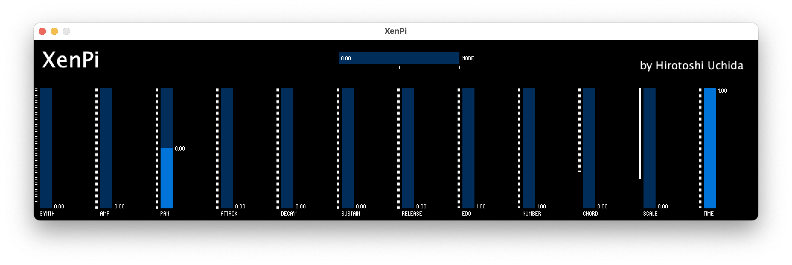
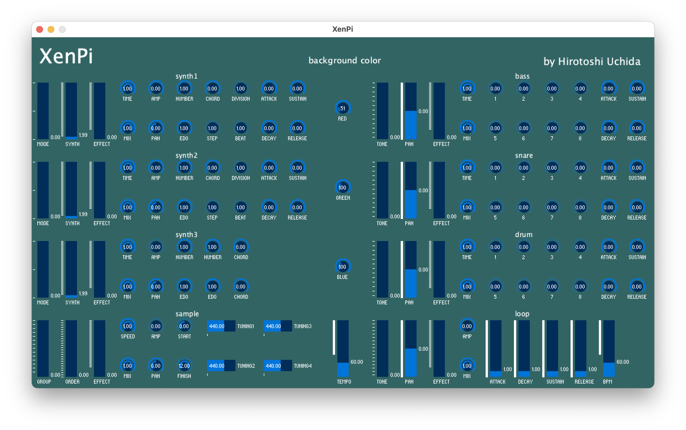
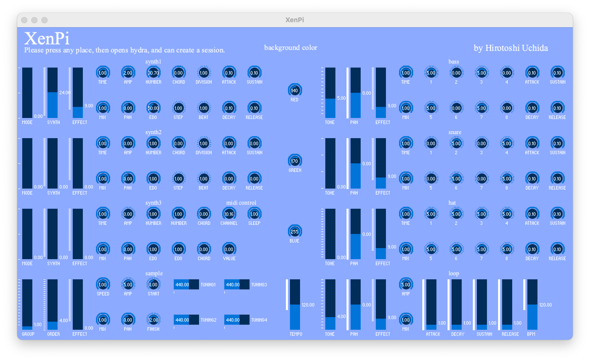

# XenPi
This is an application I developed by Sonic Pi, Processing, Orca, FoxDot, TidalCycles and Hydra for playing microtonal performance.

## Required environment

  
Software

<ol>
<li><a href="https://sonic-pi.net/">Sonic Pi</a></li>
<li><a href="https://www.oracle.com/java/technologies/downloads/">Java Environment Runtime 17 </a></li>
<li><a href="https://hydra.ojack.xyz/">Hydra </a><i>(only ver1.2, and no need to install this one since it's online)</i></li>
<li><a href="https://code.visualstudio.com/download">Text Editor like <strong>Visual Studio Code </strong></a><i>(from ver1.3 if you'll create a session with TidalCycles)</i></li>
<li><a href="https://www.haskell.org/downloads/">Haskell </a><i>(from ver1.3 if you'll create a session with TidalCycles)</i></li>
<li>TidalCycles <i>(from ver1.3, these are the installation manuals on <a href=https://tidalcycles.org/docs/getting-started/macos_install">macOS</a>, <a href="https://tidalcycles.org/docs/getting-started/windows_install">Windows</a>, and <a href="https://tidalcycles.org/docs/getting-started/linux_install">Linux</a></i></li>
<li><a href="https://www.python.org/downloads/">Python </a><i>(from ver1.3 if you'll create a session with FoxDot)</i></li>
<li>FoxDot <i>(from ver1.3, this is the installation manual, and please run the code on <a href="https://foxdot.org/installation/">following link</a>)</i></li>
<li>Orca <i>(from ver1.3, and <a href="https://hundredrabbits.itch.io/orca">this</a> is the download link, or paste "XenPi.orca" on <a href="https://hundredrabbits.github.io/Orca/">non installation version</a>) </i></li>
</ol>

## Download

  
Ver1.0

<li><a href="https://github.com/Uchida16104/XenPi/blob/main/ver1.0/XenPi.pde">macOS(Intel 64bit)</a><i> - Just download .pde and .rb files.</i></li>
<li><a href="https://github.com/Uchida16104/XenPi/raw/main/ver1.0/macos-aarch64.zip">macOS(Apple Silicon)</a></li>
<li><a href="https://github.com/Uchida16104/XenPi/raw/main/ver1.0/windows-amd64.zip">Windows(Intel 64bit)</a></li>
<li><a href="https://github.com/Uchida16104/XenPi/raw/main/ver1.0/linux-amd64.zip">Linux(Intel 64bit)</a></li>
<li><a href="https://github.com/Uchida16104/XenPi/raw/main/ver1.0/linux-arm.zip">Linux(Raspberry Pi 32bit</a></li>
<li><a href="https://github.com/Uchida16104/XenPi/raw/main/ver1.0/linux-aarch64.zip">Linux(Raspberry Pi 64bit)</a></li>

  
Ver1.1

<li><a href="https://github.com/Uchida16104/XenPi/blob/main/ver1.1/XenPi.pde">macOS(Intel 64bit)</a><i> - Just download .pde and .rb files.</i></li>
<li><a href="https://github.com/Uchida16104/XenPi/raw/main/ver1.1/macos-aarch64.zip">macOS(Apple Silicon)</a></li>
<li><a href="https://github.com/Uchida16104/XenPi/raw/main/ver1.1/windows-amd64.zip">Windows(Intel 64bit)</a></li>
<li><a href="https://github.com/Uchida16104/XenPi/raw/main/ver1.1/linux-amd64.zip">Linux(Intel 64bit)</a></li>
<li><a href="https://github.com/Uchida16104/XenPi/raw/main/ver1.1/linux-arm.zip">Linux(Raspberry Pi 32bit)</a></li>
<li><a href="https://github.com/Uchida16104/XenPi/raw/main/ver1.1/linux-aarch64.zip">Linux(Raspberry Pi 64bit)</a></li>

  
Ver1.2

<li><a href="https://github.com/Uchida16104/XenPi/blob/main/ver1.2/XenPi.pde">macOS(Intel 64bit)</a><i> - Just download .pde, .rb, and .js files.</i></li>
<li><a href="https://github.com/Uchida16104/XenPi/raw/main/ver1.2/macos-aarch64.zip">macOS(Apple Silicon)</a></li>
<li><a href="https://github.com/Uchida16104/XenPi/raw/main/ver1.2/windows-amd64.zip">Windows(Intel 64bit)</a></li>
<li><a href="https://github.com/Uchida16104/XenPi/raw/main/ver1.2/linux-amd64.zip">Linux(Intel 64bit)</a></li>
<li><a href="https://github.com/Uchida16104/XenPi/raw/main/ver1.2/linux-arm.zip">Linux(Raspberry Pi 32bit)</a></li>
<li><a href="https://github.com/Uchida16104/XenPi/raw/main/ver1.2/linux-aarch64.zip">Linux(Raspberry Pi 64bit)</a></li>

  
Ver1.3

<li><a href="https://github.com/Uchida16104/XenPi/blob/main/ver1.3/XenPi.pde">macOS(Intel 64bit)</a><i> - Just download .pde, .rb, .tidal, .py, and .orca files.</i></li>
<li><a href="https://github.com/Uchida16104/XenPi/raw/main/ver1.3/macos-aarch64.zip">macOS(Apple Silicon)</a></li>
<li><a href="https://github.com/Uchida16104/XenPi/raw/main/ver1.3/windows-amd64.zip">Windows(Intel 64bit)</a></li>
<li><a href="https://github.com/Uchida16104/XenPi/raw/main/ver1.3/linux-amd64.zip">Linux(Intel 64bit)</a></li>
<li><a href="https://github.com/Uchida16104/XenPi/raw/main/ver1.3/linux-arm.zip">Linux(Raspberry Pi 32bit)</a></li>
<li><a href="https://github.com/Uchida16104/XenPi/raw/main/ver1.3/linux-aarch64.zip">Linux(Raspberry Pi 64bit)</a></li>

## Install

  
Process

  <ol>
    <li>Re-unzip the downloaded .zip file with the contents according to your operating system.</li>
    <li>Then, run the executable file (.exe, .app, .sh), do "XenPi.rb" file on Sonic Pi, and do the code of "XenPi.js" after copying and pasting it on hydra (from ver1.2).</li>
  </ol>

## Usage

  
Ver1.0

1. Processing
<ul>
<li>Synth - means value of synth names on Sonic Pi.</li>
<li>Amp - means amp value on Sonic Pi.</li>
<li>Pan - means pan value on Sonic Pi.</li>
<li>Attack - means attack value on Sonic Pi.</li>
<li>Decay - means decay value on Sonic Pi.</li>
<li>Sustain - means sustain value on Sonic Pi.</li>
<li>Release - means release value on Sonic Pi.</li>
<li>Edo - means Edo value on Sonic Pi (Edo means Equal Division of the Octave, and microtonal tuning).</li>
<li>Number - means what number of the microtonal is playing.</li>
<li>Chord - means value of chord names when "Mode" value shows 1.</li>
<li>Scale - means value of scale names when "Mode" value shows 2.</li>
<li>Time - means how much interval separates the sounds.</li>
<li>Mode - means when value 0 is "Note", 1 is "Chord", 2 is "Scale", and can select performance type.</li>
</ul>
2. Sonic Pi
<ul>
<li><i>Just load "XenPi.rb" and run it on Sonic Pi as above.</i></li>
</ul>

  
Ver1.1

1. Processing (Additional changes)
<ul>
<li>Effect - means value of effect names on Sonic Pi.</li>
<li>Mix - means value of effect volume.</li>
<li>Division - means the value specified by "Beat" is separated by which value.</li>
<li>Beat - means how many beats to adjust the rhythm.</li>
<li>Step - means how much degree of rhythmic complexity.</li>
<li>Tone - means the kind of bass drum(:bd), snare drum(:sn), and drums(:drums) tone on Sonic Pi.</li>
<li><i>1~8</i> - means the volume of the nth beat.</li>
<li><i><strong>(Deleted function of "Scale" on "Synth" and added to change just like a techno machine compare with ver1.0.)</strong></i></li>
</ul>
2. Sonic Pi
<ul>
<li><i>Just load "XenPi.rb" and run it on Sonic Pi as above. <strong>(The file is changed!)</strong></i></li>
</ul>

  
Ver1.2

1. Processing (Additional changes)
<ul>
<li>Group - means the kind of sample.</li>
<li>Order - means the number of sample group.</li>
<li>Speed - means the rate of sample.</li>
<li>Tuning(1~4) - Tuning1 corresponds the tuning of Synth1. Tuning2 corresponds the tuning of Synth2. Tuning3 correspond the beginning tuning of Synth3 and Tuning4 correspond the terminal tuning of Synth3.</li>
<li>Bpm - means to adjust loop(:loop) tempo.</li>
<li>Red - means to adjust the red ratio including background color.</li>
<li>Green - means to adjust the green ratio including background color.</li>
<li>Blue - means to adjust the blue ratio including background color.</li>
</ul>
2. Sonic Pi
<ul>
<li><i>Just load "XenPi.rb" and run it on Sonic Pi as above. <strong>(The file is changed!)</strong></i></li>
</ul>
3. Hydra
<ul>
<li><i>Just run "XenPi.js" code and run it on Hydra as above.</i></li>
</ul>

  
Ver1.3

1. Processing (Additional changes)
<ul>
<li>Channel - means midi channel.</li>
<li>Value - means midi control value.</li>
<li>Speed - means the rate of sample.</li>
<li>Tuning(1~4) - Tuning1 corresponds the tuning of Synth1. Tuning2 corresponds the tuning of Synth2. Tuning3 correspond the beginning tuning of Synth3 and Tuning4 correspond the terminal tuning of Synth3.</li>
<li>hat - is changed from <i>loop</i>.</li>
</ul>
2. Sonic Pi
<ul>
<li><i>Just load "XenPi.rb" and run it on Sonic Pi as above. <strong>(The file is changed!)</strong></i></li>
</ul>
3. Hydra
<ul>
<li><i>Click anywhere in XenPi to jump hydra link, and can create a session. <strong>(It's recommended to operate XenPi knobs or sliders by mouse wheel)</strong></i></li>
</ul>
4. Orca
<ul>
<li><i>Just load "XenPi.orca" and run it on Orca as above.</i></li>
</ul>
5. FoxDot
<ul>
<li><i>Just load "XenPi.py" and run it on FoxDot as above.</i></li>
</ul>
6. TidalCycles
<ul>
<li><i>Just load "XenPi.tidal" and run it on TidalCycles as above.</i></li>
</ul>
7. SuperCollider
<ul>
<li><i>Just load "XenPi-T.sc" or "XenPi-F.sc" and run it on SuperCollider as above.</i></li>
</ul>

  
## Image

  
Ver1.0

  
Ver1.1

  
Ver1.2

  
Ver1.3

## Log

  
Developed

  on 25th, May, 2023

  
Published

  on 26th, May, 2023

  
Released

  on 2nd, Sep, 2023

  
Copyright

  by Hirotoshi Uchida

