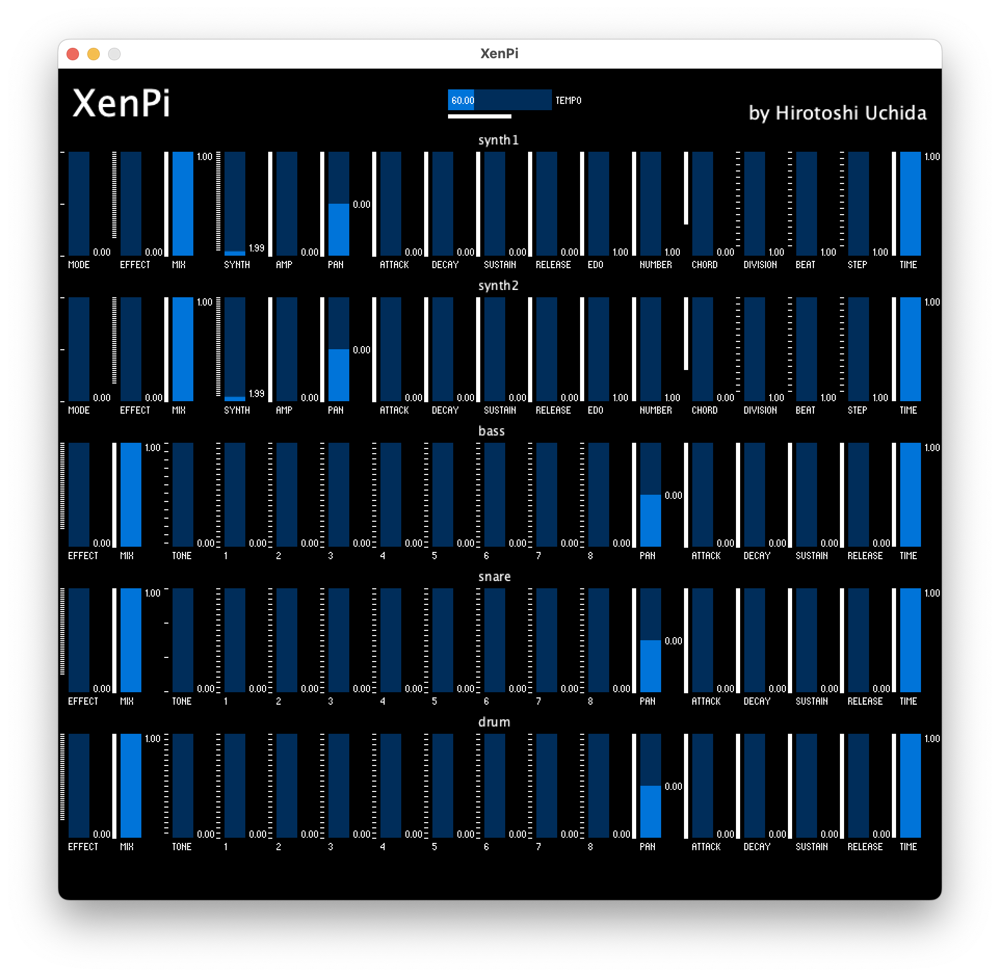

# XenPi
This is an application I developed by Sonic Pi and Processing for playing microtonal performance.

## Required environment
1. [Sonic Pi](https://sonic-pi.net/)
2. [Processing](https://processing.org/) (If you want to arrange this application)

## Download

  
Ver1.0

<li><a href="https://github.com/Uchida16104/XenPi/blob/main/ver1.0/XenPi.pde">macOS(Intel 64bit)</a> - Just download .pde and .rb files.</li>
<li><a href="https://github.com/Uchida16104/XenPi/raw/main/ver1.0/macos-aarch64.zip">macOS(Apple Silicon)</a></li>
<li><a href="https://github.com/Uchida16104/XenPi/raw/main/ver1.0/windows-amd64.zip">Windows(Intel 64bit)</a></li>
<li><a href="https://github.com/Uchida16104/XenPi/raw/main/ver1.0/linux-amd64.zip">Linux(Intel 64bit)</a></li>
<li><a href="https://github.com/Uchida16104/XenPi/raw/main/ver1.0/linux-arm.zip">Linux(Raspberry Pi 32bit</a></li>
<li><a href="https://github.com/Uchida16104/XenPi/raw/main/ver1.0/linux-aarch64.zip">Linux(Raspberry Pi 64bit)</a></li>

  
Ver1.1

<li><a href="https://github.com/Uchida16104/XenPi/blob/main/ver1.1/XenPi.pde">macOS(Intel 64bit)</a> - Just download .pde and .rb files.</li>
<li><a href="https://github.com/Uchida16104/XenPi/raw/main/ver1.1/macos-aarch64.zip">macOS(Apple Silicon)</a></li>
<li><a href="https://github.com/Uchida16104/XenPi/raw/main/ver1.1/windows-amd64.zip">Windows(Intel 64bit)</a></li>
<li><a href="https://github.com/Uchida16104/XenPi/raw/main/ver1.1/linux-amd64.zip">Linux(Intel 64bit)</a></li>
<li><a href="https://github.com/Uchida16104/XenPi/raw/main/ver1.1/linux-arm.zip">Linux(Raspberry Pi 32bit)</a></li>
<li><a href="https://github.com/Uchida16104/XenPi/raw/main/ver1.1/linux-aarch64.zip">Linux(Raspberry Pi 64bit)</a></li>

## Install
1. Re-unzip the downloaded .zip file with the contents according to your operating system.
2. Then, run the executable file (.exe, .app, .sh) and "Xen.rb" file on Sonic Pi.

## Usage

  
Ver1.0

1. Processing
<ul>
<li>Synth - means value of synth names on Sonic Pi.</li>
<li>Amp - means amp value on Sonic Pi.</li>
<li>Pan - means pan value on Sonic Pi.</li>
<li>Attack - means attack value on Sonic Pi.</li>
<li>Decay - means decay value on Sonic Pi.</li>
<li>Sustain - means sustain value on Sonic Pi.</li>
<li>Release - means release value on Sonic Pi.</li>
<li>Edo - means Edo value on Sonic Pi (Edo means Equal Division of the Octave, and microtonal tuning).</li>
<li>Number - means what number of the microtonal is playing.</li>
<li>Chord - means value of chord names when "Mode" value shows 1.</li>
<li>Scale - means value of scale names when "Mode" value shows 2.</li>
<li>Time - means how much interval separates the sounds.</li>
<li>Mode - means when value 0 is "Note", 1 is "Chord", 2 is "Scale", and can select performance type.</li>
</ul>
2. Sonic Pi
<li>Just load "Xen.rb" and run it on Sonic Pi as above.</li>

  
Ver1.1

1. Processing (Additional changes)
<ul>
<li>Effect - means value of effect names on Sonic Pi.</li>
<li>Mix - means value of effect volume.</li>
<li>Division - means the value specified by "Beat" is separated by which value.</li>
<li>Beat - means how many beats to adjust the rhythm.</li>
<li>Step - means how much degree of rhythmic complexity.</li>
<li>Tone - means the kind of bass drum(:bd), snare drum(:sn), and drums(:drums) tone on Sonic Pi.</li>
<li>1~8 - means the volume of the nth beat.</li>
<li>(Deleted function of "Scale" on "Synth" compare with ver1.0.)</li>
<ul>

## Image

  
Ver1.0

  
Ver1.1

## Log
  
<detals>
  
Developed on :

  25th, May, 2023

  
Published on :

  26th, May, 2023

  
Released on :

  4th, June, 2023

by Hirotoshi Uchida
